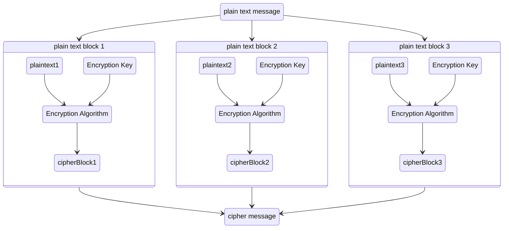
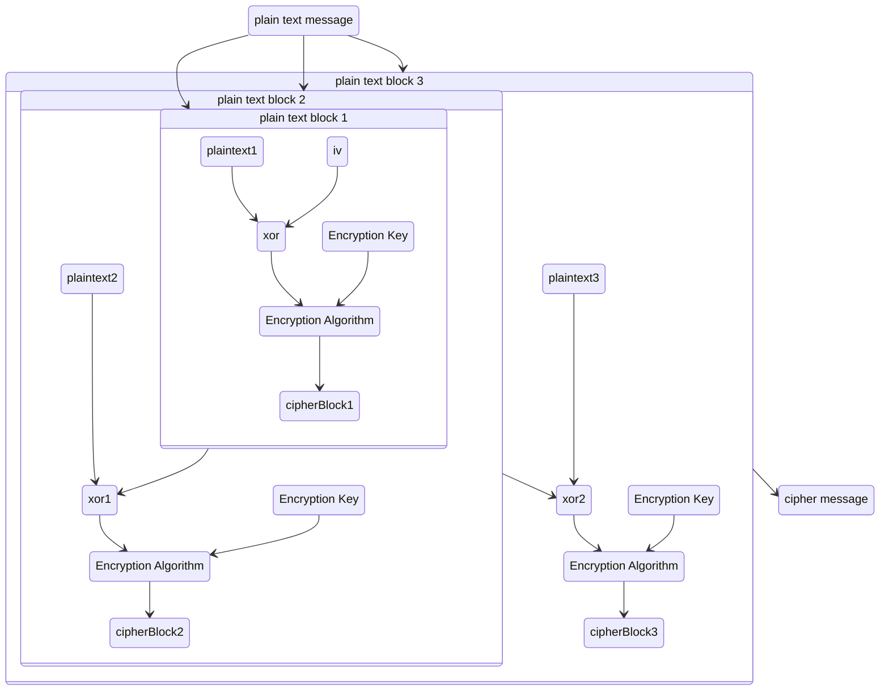

# Git Helper

[](LICENSE)

A quick-reference cheat sheet of everyday Git commands and workflows — global config,
publishing a repo, branching, stashing, rebasing, patches, aliases, and more.

Found a mistake or want to add a tip? Contributions are welcome — see
[CONTRIBUTING.md](CONTRIBUTING.md).

## Contents

- [Global Git Configuration](#global-git-configuration)
- [Push an Existing Folder to GitHub or GitLab](#push-an-existing-folder-to-github-or-gitlab)
- [Push an Existing Git Repo to a New Remote](#push-an-existing-git-repo-to-a-new-remote)
- [Revert a Modified File](#revert-a-modified-file)
- [Undo a Mistaken `git add .`](#undo-a-mistaken-git-add-)
- [Revert a Single File to a Remote Branch's Version](#revert-a-single-file-to-a-remote-branchs-version)
- [Write a Long Commit Message](#write-a-long-commit-message)
- [Create a Branch](#create-a-branch)
- [Switch to Another Branch](#switch-to-another-branch)
- [Create and Switch to a New Branch in One Step](#create-and-switch-to-a-new-branch-in-one-step)
- [Merge a Branch into Master](#merge-a-branch-into-master)
- [Fix "refusing to merge unrelated histories"](#fix-refusing-to-merge-unrelated-histories)
- [Useful .gitignore Templates](#useful-gitignore-templates)
- [Resolve "Cannot Amend" / Merge Conflicts](#resolve-cannot-amend--merge-conflicts)
- [Remove Local Untracked Files](#remove-local-untracked-files)
- [Change the Author of the Last Commit](#change-the-author-of-the-last-commit)
- [Cherry-Pick a Commit](#cherry-pick-a-commit)
- [Create and Apply a Patch](#create-and-apply-a-patch)
- [Stash Changes](#stash-changes)
- [Squash Multiple Commits into One](#squash-multiple-commits-into-one)
- [View Commit History as a Graph](#view-commit-history-as-a-graph)
- [Undo the Last Commit but Keep the Changes](#undo-the-last-commit-but-keep-the-changes)
- [Undo the Last Commit and Discard the Changes](#undo-the-last-commit-and-discard-the-changes)
- [Amend the Last Commit Message](#amend-the-last-commit-message)
- [Unstage a File](#unstage-a-file)
- [Review Staged vs Unstaged Changes](#review-staged-vs-unstaged-changes)
- [Rename a Branch](#rename-a-branch)
- [Delete a Local Branch](#delete-a-local-branch)
- [Delete a Remote Branch](#delete-a-remote-branch)
- [Set the Upstream for the Current Branch](#set-the-upstream-for-the-current-branch)
- [Fetch and Prune Deleted Remote Branches](#fetch-and-prune-deleted-remote-branches)
- [Create and Push a Tag](#create-and-push-a-tag)
- [Show a File's Contents at a Specific Commit](#show-a-files-contents-at-a-specific-commit)
- [Find Who Changed a Line (`git blame`)](#find-who-changed-a-line-git-blame)
- [Find the Commit that Introduced a Bug (`git bisect`)](#find-the-commit-that-introduced-a-bug-git-bisect)
- [Recover Lost Commits (`git reflog`)](#recover-lost-commits-git-reflog)
- [Temporarily Ignore Changes to a Tracked File](#temporarily-ignore-changes-to-a-tracked-file)
- [Force Push Safely](#force-push-safely)
- [Add and Update a Submodule](#add-and-update-a-submodule)
- [Compare Two Branches](#compare-two-branches)
- [Search Commit History for a String](#search-commit-history-for-a-string)
- [Shallow Clone a Large Repo](#shallow-clone-a-large-repo)
- [Set the Default Branch Name for New Repos](#set-the-default-branch-name-for-new-repos)
- [Git Aliases](#git-aliases)
- [Diagrams](#diagrams)
- [GITK on macOS](#gitk-on-macos)

---

### Global Git Configuration

```bash
git config --global user.name "Your Name"
git config --global user.email "you@example.com"
git config --global commit.template ~/.gitmessage
# macOS example: use Sublime Text as the default editor
git config --global core.editor "/Applications/Sublime\ Text.app/Contents/SharedSupport/bin/subl -n -w"
# automatically remove local references to remote branches that no longer exist, on every fetch
git config --global fetch.prune true
```

### Push an Existing Folder to GitHub or GitLab

```bash
cd existing_folder
git init
git remote add origin REMOTE_URL
git add .
git commit -m "Initial commit"
git push -u origin master
```

### Push an Existing Git Repo to a New Remote

```bash
cd existing_repo
git remote rename origin my_old_origin
git remote add origin REMOTE_URL
git push -u origin --all
git push -u origin --tags
```

### Revert a Modified File

```bash
git restore <filename>
```

### Undo a Mistaken `git add .`

If you ran `git add .` by mistake and want to move the files back to an uncommitted state:

```bash
git rm --cached -r .
```

or, for a single file:

```bash
git reset HEAD^ -- path/to/file
```

### Revert a Single File to a Remote Branch's Version

```bash
git restore --source origin/dev <filename>
```

### Write a Long Commit Message

Running `git commit` with no `-m` flag opens your default editor for a multi-line message:

```bash
git commit
```

### Create a Branch

```bash
git branch branch_name
```

### Switch to Another Branch

```bash
git checkout branch_name
```

### Create and Switch to a New Branch in One Step

```bash
git checkout -b branch_name
```

### Merge a Branch into Master

```bash
git checkout master
git merge branch_name
```

### Fix "refusing to merge unrelated histories"

```bash
git pull origin master --allow-unrelated-histories
```

### Useful .gitignore Templates

<https://github.com/github/gitignore>

### Resolve "Cannot Amend" / Merge Conflicts

If you see `You are in the middle of a merge. Cannot amend.` or `You cannot merge, there are
conflicts`, rebasing lets you move your branch's commits on top of the latest base branch:

```
        /o-----o---o--o-----o--------- branch
--o-o--A--o---o---o---o----o--o-o-o--- master
```

After rebasing, the branch's commits sit on top:

```
                                   /o-----o---o--o-----o------ branch
--o-o--A--o---o---o---o----o--o-o-o master
```

```bash
git rebase <branch_name>
```

Resolve any conflicts, then continue:

```bash
git rebase --continue
```

Your branch's commits are now replayed on top of the base branch and the conflict is resolved.

### Remove Local Untracked Files

Preview what will be deleted:

```bash
git clean -n
```

Then remove the files:

```bash
git clean -f          # remove untracked files
git clean -f -d       # also remove untracked directories
git clean -f -X       # remove only ignored files
git clean -f -x       # remove ignored and non-ignored files
```

### Change the Author of the Last Commit

```bash
git commit --amend --author="John Doe <john@doe.org>"
```

### Cherry-Pick a Commit

```bash
git cherry-pick <commit_id>
```

### Create and Apply a Patch

Create a patch from your current changes, or from the diff against a branch:

```bash
git diff > my.patch
# or
git diff branch_name > my.patch
```

Apply the patch:

```bash
git apply --whitespace=warn my.patch
```

### Stash Changes

Stash changes, including untracked files:

```bash
git stash save -u "change name"
```

List stashes:

```bash
git stash list
```

Apply a stash:

```bash
git stash apply stash@{number}
```

### Squash Multiple Commits into One

Say branch `abc` has two commits — an initial commit and a follow-up review commit — that you'd
like to combine into one:

```bash
git rebase -i HEAD~2
```

This opens an editor listing the commits:

```
pick 01d1124 Initial commit message
pick 6340aaa Review feedback commit message

# Rebase 60709da..30e0ccb onto 60709da
#
# Commands:
#  p, pick = use commit
#  r, reword = use commit, but edit the commit message
#  e, edit = use commit, but stop for amending
#  s, squash = use commit, but meld into previous commit
#  f, fixup = like "squash", but discard this commit's log message
#  x, exec = run command (the rest of the line) using shell
#
# If you remove a line here THAT COMMIT WILL BE LOST.
# However, if you remove everything, the rebase will be aborted.
```

Change `pick` to `squash` (or `s`) for the second commit:

```
pick 01d1124 Initial commit message
squash 6340aaa Review feedback commit message
```

Save and close the editor — the two commits are now merged into one.

### View Commit History as a Graph

```bash
git log --oneline --graph --all --decorate
```

### Undo the Last Commit but Keep the Changes

Moves `HEAD` back one commit while leaving your files (and the staging area) untouched:

```bash
git reset --soft HEAD~1
```

### Undo the Last Commit and Discard the Changes

Moves `HEAD` back one commit and discards the changes entirely. Use with care:

```bash
git reset --hard HEAD~1
```

### Amend the Last Commit Message

```bash
git commit --amend -m "New commit message"
```

### Unstage a File

Removes a file from the staging area without discarding its changes:

```bash
git restore --staged <filename>
```

### Review Staged vs Unstaged Changes

```bash
git diff              # unstaged changes
git diff --staged     # staged changes (what will be committed)
```

### Rename a Branch

```bash
git branch -m old_branch_name new_branch_name
```

### Delete a Local Branch

```bash
git branch -d branch_name    # safe delete (fails if unmerged)
git branch -D branch_name    # force delete
```

### Delete a Remote Branch

```bash
git push origin --delete branch_name
```

### Set the Upstream for the Current Branch

```bash
git push -u origin branch_name
```

### Fetch and Prune Deleted Remote Branches

Removes local references to remote branches that no longer exist:

```bash
git fetch --prune
```

### Create and Push a Tag

```bash
git tag -a v1.0.0 -m "Release version 1.0.0"
git push origin v1.0.0
```

List all tags:

```bash
git tag
```

### Show a File's Contents at a Specific Commit

```bash
git show <commit_id>:path/to/file
```

### Find Who Changed a Line (`git blame`)

```bash
git blame path/to/file
```

### Find the Commit that Introduced a Bug (`git bisect`)

```bash
git bisect start
git bisect bad                # current commit is broken
git bisect good <commit_id>   # a known-good commit
# Git checks out a commit in between - test it, then run:
git bisect good   # or
git bisect bad
# repeat until Git identifies the offending commit, then:
git bisect reset
```

### Recover Lost Commits (`git reflog`)

If you lost commits after a hard reset or rebase, `reflog` tracks where `HEAD` has been:

```bash
git reflog
git checkout <commit_id>   # or git reset --hard <commit_id>
```

### Temporarily Ignore Changes to a Tracked File

Useful for local config files you don't want to accidentally commit:

```bash
git update-index --assume-unchanged path/to/file
```

To start tracking changes again:

```bash
git update-index --no-assume-unchanged path/to/file
```

### Force Push Safely

Prefer `--force-with-lease` over `--force` — it aborts if someone else pushed new commits you
don't have locally yet:

```bash
git push --force-with-lease
```

### Add and Update a Submodule

```bash
git submodule add REMOTE_URL path/to/submodule
git submodule update --init --recursive
```

### Compare Two Branches

```bash
git diff branch_a..branch_b            # full diff
git log branch_a..branch_b --oneline   # commits in branch_b not in branch_a
```

### Search Commit History for a String

Search commit messages:

```bash
git log --grep="search term"
```

Search for a string that was added or removed in the code (the "pickaxe"):

```bash
git log -S"search term" --oneline
```

### Shallow Clone a Large Repo

Clones only the most recent history, which is much faster for large repos:

```bash
git clone --depth 1 REMOTE_URL
```

### Set the Default Branch Name for New Repos

```bash
git config --global init.defaultBranch main
```

### Git Aliases

Add these to your global `.gitconfig`:

- **Command line**
  - Windows: `git config --global alias.ci "commit -v"`
  - macOS/Linux: `git config --global alias.ci 'commit -v'`
- **Directly editing the file**
  - Windows: `C:\Users\<you>\.gitconfig`
  - macOS/Linux: `~/.gitconfig`

```ini
[alias]
	rdev = reset --hard origin/dev
	pd = pull origin dev
	ca = commit --amend
	com = commit
	cb = checkout -b
	co = checkout
	ui = !gitk --all
```

Use them like `git pd` or `git ui`.

### Diagrams

<details>
<summary><strong>Encryption workflow examples</strong></summary>





</details>

### GITK on macOS

If `gitk --all` doesn't work on macOS, install it via:

```bash
brew install git-gui
```

---

## License

This project is licensed under the [MIT License](LICENSE).
